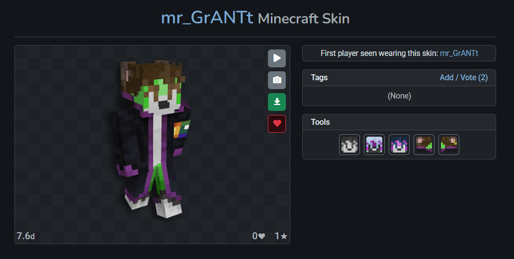

# Streamer Heads
> This is a simple panel for OBS Studio (or other streaming services) that displays the head of chatters. With the skins they assigned.

## Start Bot
1. Install [Node.js](https://nodejs.org/en/download).
2. Install dependencies:
    ```Bash
    npm init -y
    npm install ws
    npm install axios sharp
    ```
3. Start the server by clicking `start.bat` or use command:
    ```Bash
    node ./server.js
    ```
4. In the browser source in OBS Studio, set the file link (something like `file:///path/to/file/index.html`)
5. Width: 1346; Height: 1097; Other options as you want.
6. Install and connect [Streamer.bot](https://streamer.bot/).
7. Go to Servers/Clients -> WebSocket Clients -> Right Mouse Click -> Add
8. Name as you want. Endpoint: `ws://127.0.0.1:8081/`
9. Go to Actions -> Right Mouse Click -> Add
10. Name as you want. Click `Ok`
11. In Triggers:
    1. Right Mouse Click -> Core -> Commands -> Command Trigered
    2. Select your command or `Create Command`
12. In Sub-Actions:
    1. Core -> C# -> Execute C# Code
    2. Place this code: 
        ```C#
        using System;

        public class CPHInline
        {
            public bool Execute()
            {
                string src = args.ContainsKey("rawInput") ? args["rawInput"].ToString() : "";
                string msgid = args.ContainsKey("msgId") ? args["msgId"].ToString() : "";
                string user = args.ContainsKey("user") ? args["user"].ToString() : "";

                if (msgid.Equals("") || user.Equals("")) {
                    return false;
                }
                if (!src.Equals("") && !src.StartsWith("https://s.namemc.com/"))
                {
                    CPH.TwitchReplyToMessage("Укажите ссылку на скин c namemc(гайд:)", msgid);
                    return false;
                }

                string data = user + "|" + src;
            
                CPH.WebsocketSend(data);
                CPH.TwitchReplyToMessage("Запрос отправлен!", msgid);
                return true;
            }
        }
        ```
    3. Click `Save and Compile`
13. Check work. Send in chat your command

## How to use command
> The command may vary in different chats. We will look at the example of `!skin` 

### Default use (`!skin`)
This command will create steve's(or last sender's skin) head with name of command sender.

### With link (`!skin <url to NameMC's skin>`)
This command will create head with name of command sender and skin from url.
Link must be from NameMC. To get link:
1. Go to skin page

2. Hover over the green loading icon
3. Ckick Right Mouse Click -> Copy link address
4. Send `!skin <copied link>` to chat